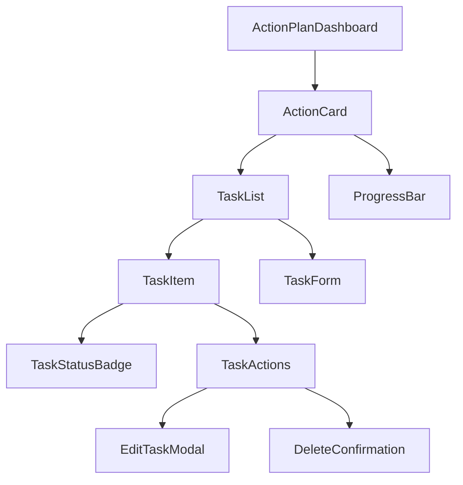
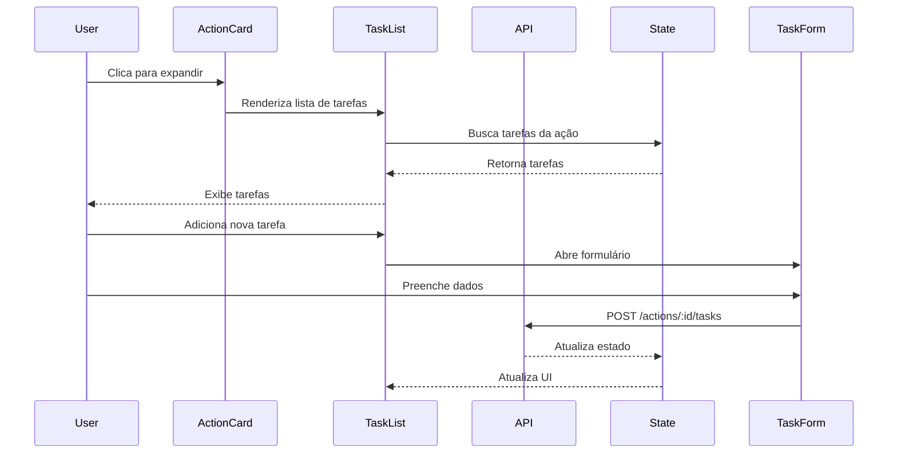

# Documento de Design - Sistema de Tarefas para Ações

## Visão Geral

Este documento descreve o design técnico para implementar um sistema hierárquico de tarefas dentro das ações do plano de ação. O sistema permitirá que cada ação contenha múltiplas tarefas, proporcionando um gerenciamento mais granular e detalhado das atividades.

## Arquitetura

### Diagrama de Componentes



### Fluxo de Dados



## Componentes e Interfaces

### 1. Modelos de Dados (types.ts)

```typescript
// Novo tipo para status de tarefa
export type TaskStatus = 'Não Iniciado' | 'Em Andamento' | 'Concluído';

// Nova interface para Tarefa
export interface Task {
    id: string;
    actionId: number | string;
    action: string; // Título/descrição da tarefa (mesmo campo que Action)
    responsible: string;
    sector: string;
    status: TaskStatus;
    startDate: string;
    endDate: string;
    order: number;
    createdAt: string;
    updatedAt: string;
}

// Atualização da interface Action
export interface Action {
    id: number | string;
    action: string;
    responsible: string;
    sector: string;
    startDate: string;
    endDate: string;
    status: TaskStatus;
    followUp: string;
    tasks?: Task[]; // Array opcional de tarefas
}

// Nova interface para progresso
export interface ActionProgress {
    total: number;
    completed: number;
    percentage: number;
}
```

### 2. TaskList Component

**Responsabilidade:** Gerenciar e exibir a lista de tarefas de uma ação.

**Props:**
```typescript
interface TaskListProps {
    actionId: number | string;
    tasks: Task[];
    onTaskAdd: (task: Omit<Task, 'id' | 'createdAt' | 'updatedAt'>) => Promise<void>;
    onTaskUpdate: (taskId: string, updates: Partial<Task>) => Promise<void>;
    onTaskDelete: (taskId: string) => Promise<void>;
    onTaskReorder: (taskId: string, newOrder: number) => Promise<void>;
}
```

**Funcionalidades:**
- Renderizar lista de tarefas ordenadas
- Botão "Adicionar Tarefa"
- Drag and drop para reordenação
- Animações de entrada/saída

### 3. TaskItem Component

**Responsabilidade:** Exibir uma tarefa individual com suas informações e ações.

**Props:**
```typescript
interface TaskItemProps {
    task: Task;
    onEdit: () => void;
    onDelete: () => void;
    onStatusChange: (newStatus: TaskStatus) => void;
    isDragging?: boolean;
}
```

**Layout:**
```
┌─────────────────────────────────────────────┐
│ [Drag Handle] Título da Tarefa              │
│                                              │
│ 👤 Responsável: Nome                         │
│ 🏢 Setor: Nome do Setor                     │
│ ⏰ Início: DD/MM/YYYY  Fim: DD/MM/YYYY      │
│ Status: [Badge]                              │
│                                              │
│ [Editar] [Excluir]                          │
└─────────────────────────────────────────────┘
```

### 4. TaskForm Component

**Responsabilidade:** Formulário modal para criar/editar tarefas.

**Props:**
```typescript
interface TaskFormProps {
    isOpen: boolean;
    onClose: () => void;
    onSubmit: (task: Omit<Task, 'id' | 'createdAt' | 'updatedAt'>) => Promise<void>;
    initialData?: Task;
    actionDateRange: { start: string; end: string };
}
```

**Campos:**
- Ação/Título (obrigatório, max 200 caracteres)
- Responsável (obrigatório, max 100 caracteres)
- Setor (obrigatório, max 100 caracteres)
- Status (dropdown: Não Iniciado, Em Andamento, Concluído)
- Data de início (date picker, validado contra ação)
- Data de término (date picker, validado contra ação)

**Validações:**
- Ação/Título não pode estar vazio
- Responsável não pode estar vazio
- Setor não pode estar vazio
- Data de início deve ser >= data de início da ação
- Data de término deve ser <= data de término da ação
- Data de término deve ser >= data de início

### 5. ProgressBar Component

**Responsabilidade:** Exibir progresso visual da ação baseado em tarefas.

**Props:**
```typescript
interface ProgressBarProps {
    progress: ActionProgress;
    showLabel?: boolean;
    size?: 'sm' | 'md' | 'lg';
}
```

**Visual:**
```
Progresso: 3/5 tarefas concluídas (60%)
[████████████░░░░░░░░] 60%
```

### 6. ActionCard (Atualizado)

**Mudanças:**
- Adicionar seção de tarefas expansível
- Exibir ProgressBar quando houver tarefas
- Indicador visual de número de tarefas
- Botão para expandir/recolher tarefas

**Novo Layout:**
```
┌─────────────────────────────────────────────┐
│ ID: 123                    [Status Badge]    │
│                                              │
│ Título da Ação                               │
│                                              │
│ 👤 Responsável  🏢 Setor  ⏰ Prazo          │
│                                              │
│ ┌──────────────────────────────────────┐   │
│ │ 📋 3/5 tarefas  [████░░] 60%         │   │
│ │ [▼ Ver Tarefas]                      │   │
│ └──────────────────────────────────────┘   │
│                                              │
│ [Expandido: Lista de Tarefas]               │
│                                              │
│ [Ver Detalhes ▼]                            │
└─────────────────────────────────────────────┘
```

## Gerenciamento de Estado

### Context API

Criar um novo contexto para gerenciar tarefas:

```typescript
interface TaskContextType {
    tasks: Record<string | number, Task[]>; // Mapeado por actionId
    loading: boolean;
    error: string | null;
    
    // Actions
    fetchTasksForAction: (actionId: string | number) => Promise<void>;
    addTask: (actionId: string | number, task: Omit<Task, 'id' | 'createdAt' | 'updatedAt'>) => Promise<void>;
    updateTask: (taskId: string, updates: Partial<Task>) => Promise<void>;
    deleteTask: (taskId: string) => Promise<void>;
    reorderTask: (taskId: string, newOrder: number) => Promise<void>;
    
    // Computed
    getTasksForAction: (actionId: string | number) => Task[];
    getActionProgress: (actionId: string | number) => ActionProgress;
}
```

### Estado Local

Cada componente mantém seu próprio estado para:
- `TaskList`: estado de expansão, drag state
- `TaskForm`: valores do formulário, validação
- `ActionCard`: estado de expansão de tarefas

## Modelos de Dados

### Estrutura no Backend

```typescript
// Tabela: tasks
interface TaskDB {
    id: string; // UUID
    action_id: number;
    action: string; // Título/descrição da tarefa
    responsible: string;
    sector: string;
    status: 'Não Iniciado' | 'Em Andamento' | 'Concluído';
    start_date: Date;
    end_date: Date;
    order: number;
    created_at: Date;
    updated_at: Date;
}
```

### Relacionamento

```
actions (1) ──── (N) tasks
```

## API Endpoints

### GET /api/actions/:actionId/tasks
Retorna todas as tarefas de uma ação.

**Response:**
```json
{
    "success": true,
    "data": [
        {
            "id": "uuid-1",
            "actionId": 123,
            "action": "Realizar levantamento de dados",
            "responsible": "João Silva",
            "sector": "TI",
            "status": "Em Andamento",
            "startDate": "2025-01-01",
            "endDate": "2025-01-15",
            "order": 1,
            "createdAt": "2025-01-01T10:00:00Z",
            "updatedAt": "2025-01-01T10:00:00Z"
        }
    ]
}
```

### POST /api/actions/:actionId/tasks
Cria uma nova tarefa.

**Request:**
```json
{
    "action": "Elaborar relatório técnico",
    "responsible": "Maria Santos",
    "sector": "Engenharia",
    "status": "Não Iniciado",
    "startDate": "2025-01-01",
    "endDate": "2025-01-15"
}
```

**Response:**
```json
{
    "success": true,
    "data": {
        "id": "uuid-2",
        "actionId": 123,
        "action": "Elaborar relatório técnico",
        "responsible": "Maria Santos",
        "sector": "Engenharia",
        "status": "Não Iniciado",
        "startDate": "2025-01-01",
        "endDate": "2025-01-15",
        "order": 2,
        "createdAt": "2025-01-10T14:30:00Z",
        "updatedAt": "2025-01-10T14:30:00Z"
    }
}
```

### PATCH /api/tasks/:taskId
Atualiza uma tarefa existente.

**Request:**
```json
{
    "status": "Concluído",
    "responsible": "Pedro Costa",
    "endDate": "2025-01-20"
}
```

### DELETE /api/tasks/:taskId
Exclui uma tarefa.

**Response:**
```json
{
    "success": true,
    "message": "Tarefa excluída com sucesso"
}
```

### PATCH /api/tasks/:taskId/reorder
Reordena uma tarefa.

**Request:**
```json
{
    "newOrder": 3
}
```

## Tratamento de Erros

### Estratégias

1. **Validação no Frontend:**
   - Validar campos antes de enviar ao backend
   - Exibir mensagens de erro inline no formulário
   - Desabilitar botão de submit enquanto houver erros

2. **Erros de API:**
   - Exibir toast notification para erros gerais
   - Manter dados localmente em caso de falha de rede
   - Implementar retry automático para operações críticas

3. **Estados de Erro:**
   ```typescript
   interface ErrorState {
       type: 'validation' | 'network' | 'server';
       message: string;
       field?: string; // Para erros de validação
       retryable: boolean;
   }
   ```

### Mensagens de Erro

- **Validação:** "A descrição da tarefa é obrigatória"
- **Validação:** "O responsável é obrigatório"
- **Validação:** "O setor é obrigatório"
- **Data inválida:** "A data de término deve estar dentro do prazo da ação"
- **Rede:** "Não foi possível salvar. Tentando novamente..."
- **Servidor:** "Erro ao processar solicitação. Tente novamente mais tarde"

## Estratégia de Testes

### Testes Unitários

1. **Componentes:**
   - TaskList: renderização, adição, reordenação
   - TaskItem: exibição de dados, ações
   - TaskForm: validação, submissão
   - ProgressBar: cálculo de porcentagem

2. **Utilitários:**
   - Cálculo de progresso
   - Validação de datas
   - Ordenação de tarefas

### Testes de Integração

1. **Fluxos Completos:**
   - Criar tarefa → Verificar na lista
   - Editar tarefa → Verificar atualização
   - Excluir tarefa → Verificar remoção
   - Reordenar tarefas → Verificar nova ordem

2. **Context:**
   - Fetch de tarefas
   - Sincronização com backend
   - Atualização de estado

### Testes E2E (Opcional)

- Criar ação com tarefas
- Marcar tarefas como concluídas
- Verificar atualização de progresso
- Filtrar ações por tarefas

## Considerações de Performance

### Otimizações

1. **Lazy Loading:**
   - Carregar tarefas apenas quando ActionCard é expandido
   - Implementar virtualização para listas grandes (>50 tarefas)

2. **Debouncing:**
   - Salvar edições com debounce de 500ms
   - Evitar múltiplas requisições simultâneas

3. **Memoização:**
   - Usar `useMemo` para cálculo de progresso
   - Usar `React.memo` para TaskItem

4. **Otimistic Updates:**
   - Atualizar UI imediatamente
   - Reverter em caso de erro

### Métricas

- Tempo de carregamento de tarefas: < 200ms
- Tempo de resposta para ações: < 100ms
- Tamanho do bundle: +15KB (gzipped)

## Acessibilidade

### ARIA Labels

```typescript
// TaskList
<div role="list" aria-label="Lista de tarefas">
    
// TaskItem
<div role="listitem" aria-label={`Tarefa: ${task.title}`}>

// TaskForm
<form aria-label="Formulário de tarefa">
    <input aria-label="Descrição da tarefa" aria-required="true" />
    <input aria-label="Responsável" aria-required="true" />
    <input aria-label="Setor" aria-required="true" />
    <select aria-label="Status da tarefa" />
    <input type="date" aria-label="Data de início" />
    <input type="date" aria-label="Data de término" />
```

### Navegação por Teclado

- Tab: navegar entre elementos
- Enter: abrir/fechar expansão, confirmar ações
- Escape: fechar modais
- Space: selecionar checkboxes
- Arrow keys: navegar em listas

### Contraste e Cores

- Manter contraste mínimo de 4.5:1
- Não depender apenas de cor para informação
- Suportar tema claro e escuro

## Responsividade

### Breakpoints

```css
/* Mobile: < 640px */
- Layout vertical
- Tarefas em lista simples
- Formulário em tela cheia

/* Tablet: 640px - 1024px */
- Layout adaptativo
- Tarefas em grid 2 colunas
- Modal centralizado

/* Desktop: > 1024px */
- Layout otimizado
- Tarefas em grid 3+ colunas
- Modal com largura fixa
```

### Touch Gestures

- Swipe left: revelar ações (editar/excluir)
- Long press: iniciar drag and drop
- Tap: expandir/recolher

## Migração e Compatibilidade

### Dados Existentes

1. **Ações sem tarefas:**
   - Continuar funcionando normalmente
   - Campo `tasks` será `undefined` ou `[]`
   - Progresso baseado apenas no status da ação

2. **Migração gradual:**
   - Não forçar criação de tarefas
   - Permitir uso misto (com e sem tarefas)
   - Documentar benefícios de usar tarefas

### Versionamento

- API versão: v1
- Manter compatibilidade com clientes antigos
- Adicionar header `X-API-Version: 1`

## Segurança

### Validações

1. **Backend:**
   - Validar ownership (usuário pode editar apenas suas tarefas)
   - Sanitizar inputs (prevenir XSS)
   - Limitar taxa de requisições (rate limiting)

2. **Frontend:**
   - Validar dados antes de enviar
   - Escapar conteúdo HTML
   - Implementar CSRF protection

### Permissões

```typescript
interface TaskPermissions {
    canCreate: boolean;
    canEdit: boolean;
    canDelete: boolean;
    canReorder: boolean;
}
```

## Monitoramento e Logs

### Métricas a Coletar

- Número médio de tarefas por ação
- Taxa de conclusão de tarefas
- Tempo médio para completar tarefa
- Erros de API por endpoint

### Logs

```typescript
// Exemplo de log
logger.info('Task created', {
    actionId: 123,
    taskId: 'uuid-1',
    userId: 'user-456',
    timestamp: new Date().toISOString()
});
```

## Roadmap Futuro

### Fase 2 (Opcional)

- Subtarefas (tarefas dentro de tarefas)
- Anexos em tarefas
- Comentários em tarefas
- Atribuição de responsáveis por tarefa
- Notificações push
- Integração com calendário
- Exportação de relatórios

### Melhorias de UX

- Templates de tarefas comuns
- Duplicação de tarefas
- Histórico de alterações
- Atalhos de teclado
- Modo offline com sincronização
